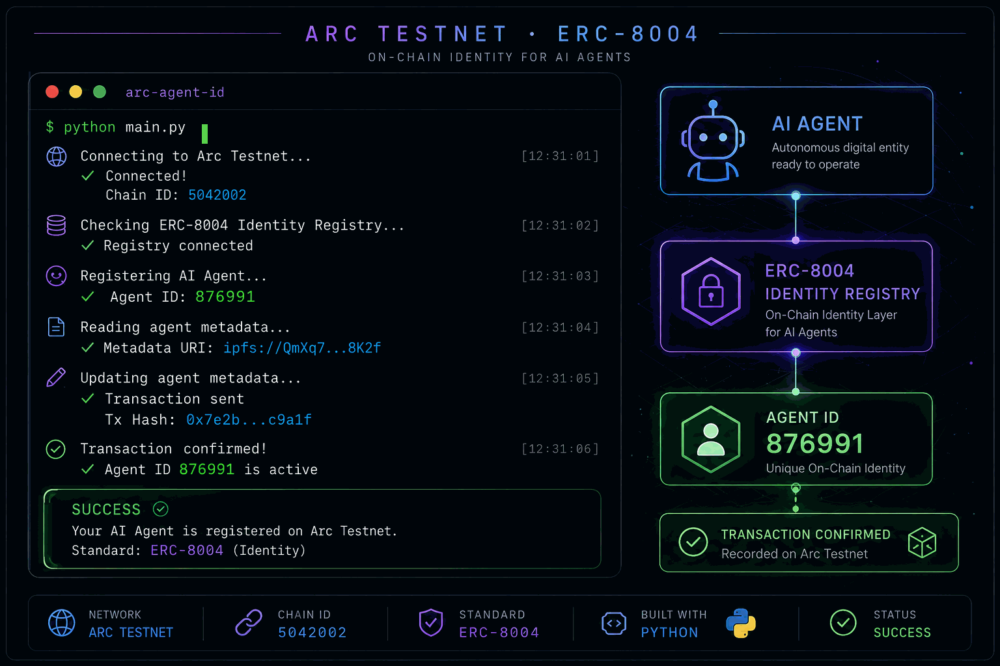

  

# 👋 Hi, I am Nomad

🚀 Crypto Researcher ⚡ DeFi Explorer

🛠 GitHub Experiments • Open Source • Automation

## About Me

🌐 Interested in Web3 and DeFi

💻 Learning Git and GitHub

🐍 Exploring Python and automation

🚀 Building practical projects step by step

## Current Focus

* Git and GitHub
* Open Source
* Blockchain Infrastructure
* AI Tools

## 💻 Languages

<!-- LANGUAGES:START -->
- **Python** 83.6%
- **TypeScript** 9.0%
- **CSS** 6.3%
- **JavaScript** 0.7%
- **HTML** 0.5%
<!-- LANGUAGES:END -->

## Projects

### Arc Payment Monitor

Real-time token payment monitoring for the Arc network.

[View repository](https://github.com/Nomad07/arc-payment-monitor)

### Arc Agent ID

A Python toolkit for registering and checking AI agent identities on Arc Testnet using ERC-8004.

[View repository](https://github.com/Nomad07/arc-agent-id)

Thanks for visiting my profile!

  

